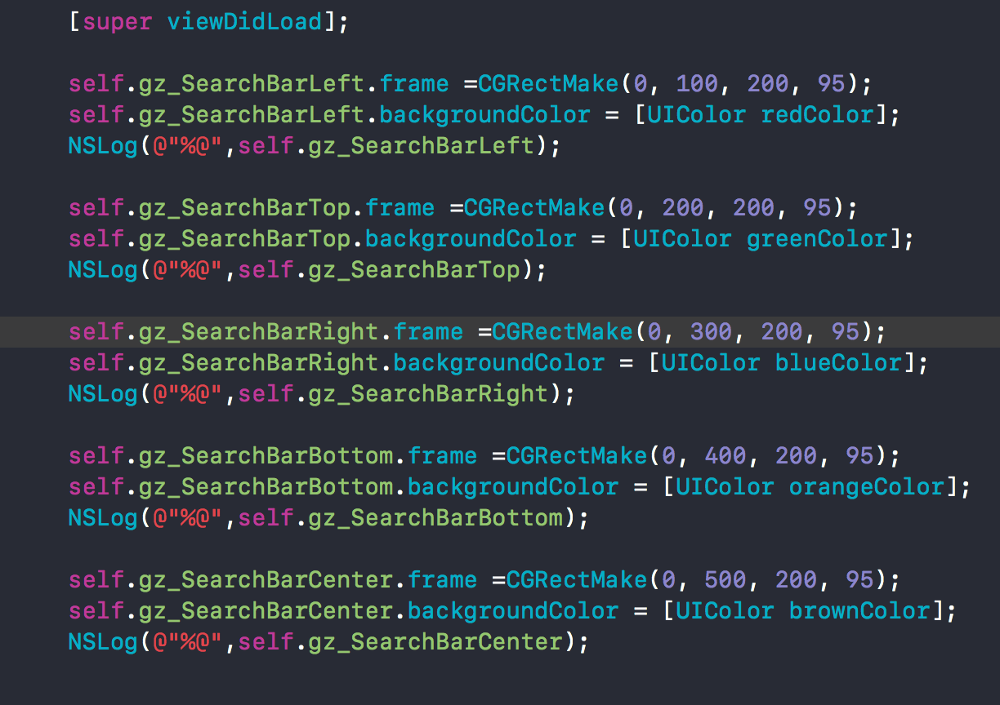
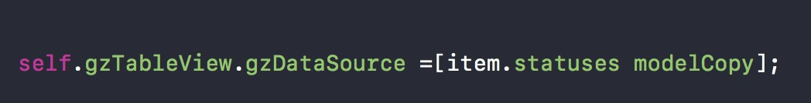
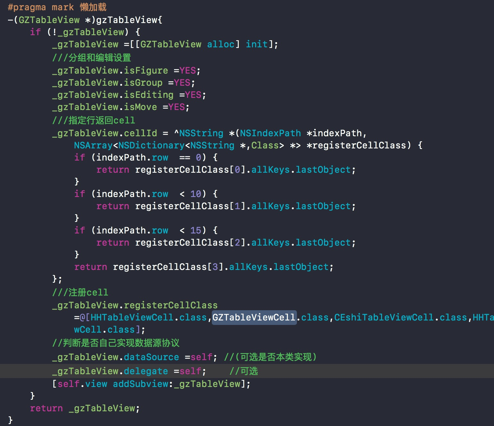

# SimplifyTableView
简化TableView

### 使用部分
做最基础的框架搭建,致力于快速开发.

**在这里.你可以在任何一个UIKit下的子类中self.(View)(替你进行了懒加载哦)**

你是不是以为我写的有属性啊.确实有,只是不想让你知道罢了   

**在这里.你可以在基类里什么都不用写都已经替你写好了一个tableView.(如果你可以.你将在你的工程里永远不会自己写列表)**

这样使用一个TableView你会习惯吗?  

还有这个设置数据  

**在这里.你的网络请求或许不再需要请求的时候在传入URL(参数还是需要的)**  

不知道看不到URL的请求用着会怎么样  

